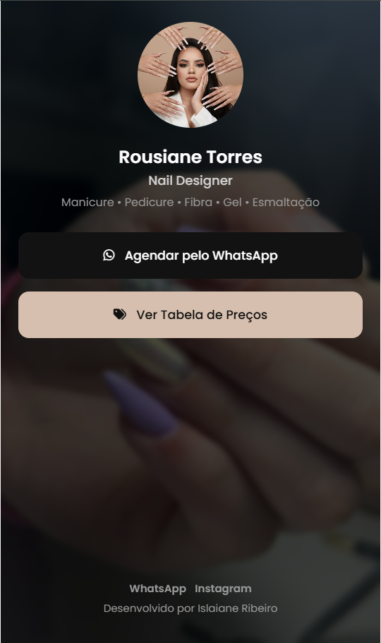
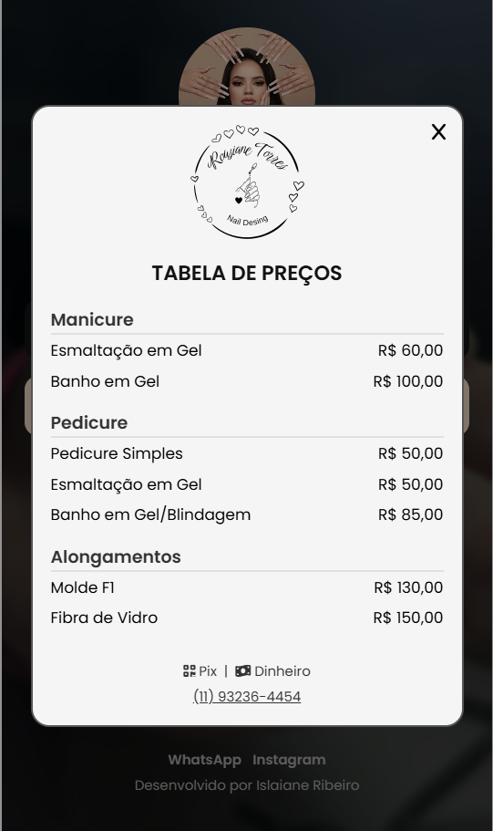

# 💅 Link na Bio – Nail Designer

Projeto de **Link na Bio** desenvolvido como solução front-end para centralizar contatos e serviços de uma profissional da área de beleza, com foco em **mobile-first, acessibilidade e conversão para WhatsApp**. O projeto simula uma demanda real de cliente, priorizando clareza visual, boa experiência do usuário e organização de código.

📌 **Tipo de projeto:** Projeto voluntário desenvolvido para cliente real, com foco em resolver uma demanda prática de negócio.

<div align="center">
  
  &nbsp;&nbsp;
  
</div>

🔗 Acesse o projeto online: https://rousiane-nails.vercel.app/

---

## 🎯 O que este projeto demonstra

- Desenvolvimento de interface **mobile-first** focada em conversão;
- Uso de **HTML semântico** e boas práticas de acessibilidade;
- Estruturação de layout simples, elegante e orientada à usabilidade;
- Implementação de interações com **JavaScript puro** (abertura e fechamento de modal);
- Organização clara de arquivos e separação de responsabilidades.

---

## 🚀 Tecnologias Utilizadas

- **HTML5** — estrutura semântica;
- **CSS3** — estilização, layout e responsividade;
- **JavaScript** — controle de interações e lógica do modal;
- **Font Awesome** — ícones;
- **Google Fonts (Poppins)** — tipografia.

---

## 📌 Funcionalidades

### Tela Inicial (Link na Bio)

- Exibição de foto de perfil e identificação profissional;
- Descrição clara dos serviços oferecidos;
- Botão de **agendamento direto via WhatsApp**;
- Botão para visualização da **tabela de preços**;
- Layout otimizado para uso via Instagram e dispositivos móveis.

### Modal – Tabela de Preços

- Lista organizada de serviços por categoria;
- Preços apresentados de forma legível;
- Modal com scroll interno para melhor experiência em telas pequenas;
- Botão de fechar acessível e intuitivo.

### Interface e Experiência do Usuário

- Interface minimalista com foco no conteúdo;
- Paleta de cores neutra e elegante;
- Layout totalmente responsivo;
- Estrutura pensada para facilitar reutilização e manutenção.

---

## 🧠 Organização do Código

Estrutura de pastas e arquivos do projeto:

```
📁 src
├─ 📁 css
│  └─ style.css          # Estilos globais do projeto
├─ 📁 js
│  └─ script.js          # Lógica de abertura e fechamento do modal
├─ 📁 images
│  ├─ profile.jpg        # Foto de perfil
│  ├─ logo.png           # Logo da profissional
│  └─ background.jpg     # Imagem de fundo
│
📄 index.html            # Estrutura principal da aplicação
```

---

## 🛠️ Como Rodar o Projeto Localmente

1. Clone o repositório:

```bash
git clone https://github.com/islaianeribeiro/nail-designer-link-bio.git
```

2. Acesse a pasta do projeto:

```bash
cd nail-designer-link-bio
```

3. Abra o arquivo `index.html` no navegador ou utilize uma extensão como **Live Server**.

---

## 🔧 Melhorias Futuras

- [ ] Animações suaves para feedback visual;
- [ ] Versão configurável para múltiplas clientes;
- [ ] Integração com API de agendamento;
- [ ] Tema claro/escuro opcional.

---

## 🧠 Conclusão

Este projeto representa uma solução prática e acessível para pequenos negócios, demonstrando a capacidade de desenvolver interfaces funcionais, orientadas à conversão e focadas em usuários mobile.

Além disso, reforça boas práticas de front-end e organização de código, podendo ser facilmente adaptado para diferentes segmentos profissionais.

---

## 👩‍💻 Desenvolvido por

**Islaiane Ribeiro**
Desenvolvedora Front-End

🔗 LinkedIn: [https://www.linkedin.com/in/islaianeribeiro](https://www.linkedin.com/in/islaianeribeiro)

---

## 📄 Licença

Este projeto está licenciado sob a licença MIT e pode ser utilizado como base
para estudos e projetos pessoais.

⚠️ Identidade visual e dados da cliente não devem ser reutilizados sem autorização.
